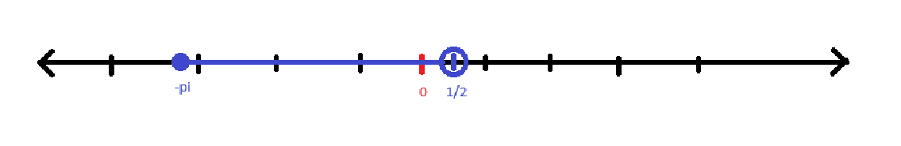
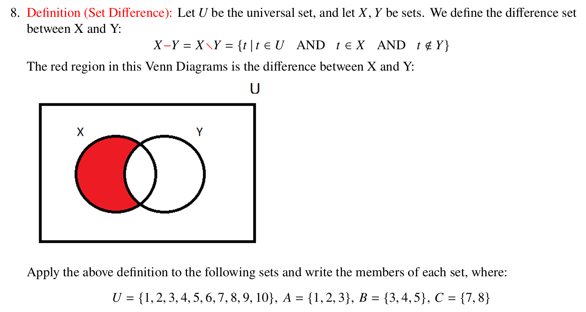

# Arnav Kucheriya - CS 241 - Homework 1
# Part 1:

#### **Question 1: Determine True, False, or Syntax Error**

(a) **$A \subseteq B$**: False. 
- $B = \{2, 3\}$, but $A = \{1, 2, 3\}$, and $1 \in A$ but not in $B$.

(b) **$B \subseteq A$**: True. 
- All elements of $B$ (2, 3) are in $A$.

(c) **$A \subseteq A$**: True. 
- A set is always a subset of itself.

(d) **$2 \subset B$**: Syntax error. 
- “2” is an element, not a set.

(e) **$A \subset A$**: False. 
- A set cannot be a proper subset of itself.

(f) **$B \subset A$**: True. 
- $B$ is a proper subset of $A$ as $B \subseteq A$ and $A \neq B$.

(g) **$B \in A$**: False. 
- $B = \{2, 3\}$ is not an element of $A$.

(h) **$B \in C$**: True. 
- $C = \{A, B\}$, and $B$ is an element of $C$.

(i) **$2 \in 2$**: Syntax error. 
- An element cannot contain itself.

(j) **$(A, B) \in C$**: False. 
- $(A, B)$ is not an element of $C$.

(k) **$(1, 3) \in A \times B$**: True. 

(l) **$(1, 3) \subseteq A \times B$**: False. 
- $(1, 3)$ is a pair, not a set of pairs.

(m) **$(1, 3) \in C$**: False. 
- $(1, 3)$ is not an element of $C$.

(n) **$0 \in E$**: False. 
- $E = \{\{0, 4\}\}$, and $0$ is not directly an element of $E$.

---

#### **Question 2: Explicitly write all elements in the given sets**

(a) **$B \times A$**: 
$$\{(2,1), (2,2), (2,3), (3,1), (3,2), (3,3)\}$$

(b) **$A \times D$**:
$$\{(1, 'a'), (2, 'a'), (3, 'a')\}$$

(c) **$\emptyset \times B$**:
$$\emptyset \text{ (empty set)}$$

(d) **$C \times C$**:
$$\{(A, A), (A, B), (B, A), (B, B)\}$$

(e) **$E \times B$**:
$$\{\{0, 4\}, 2\}, \{\{0, 4\}, 3\}$$

(f) **$P(E)$**: Powerset of $E = \{\emptyset, \{\{0, 4\}\}\}$.

(g) **$P(A)$**:
$$\{\emptyset, \{1\}, \{2\}, \{3\}, \{1, 2\}, \{1, 3\}, \{2, 3\}, \{1, 2, 3\}\}$$

(h) **$P(\emptyset)$**: Powerset of the empty set = $\{\emptyset\}$.

---

**Question 3: Solve for each set condition**

(a) \( $\{x \mid x - 5 = 0\}$ = $\{5\}$ \)

(b) \( $\{x \mid x^2 - 5 = 0\}$ = $\left\{ \sqrt{5}, -\sqrt{5} \right\}$ \)  

(c) \( $\{(x,y) \mid x \in \mathbb{N}, x < 5, y = 0\}$ = $\{(1,0), (2,0), (3,0), (4,0)\}$ \)  

(d) \( $\{4x \mid x \in \mathbb{Z}, -1 \leq x \leq 1\}$ = $\{-4, 0, 4\}$ \)  

(e) \( $\{a + b \mid a \in \mathbb{N}, a < 3, b \in \{5,6\} \}$ = $\{6,7,7,8\}$ = $\{6,7,8\}$ \)  

---

**Question 4:**

{${t|t\in R,}$ AND ${-\pi \le t \le 1/2}$ }

The subset  is represented as an interval starting at $-\pi$ (inclusive) and going up to $\frac{1}{2}$ (exclusive).

---

**Question 5: True, False, or Syntax Error**

(a) ${2} \in P(B)$: True. 
- ${2}$ is an element of the powerset of $B$.

(b) $2 \in P(B)$: False. 
- $2$ is not a subset of $B$.

(c) ${2} \subseteq P(B)$: True. 
- ${2}$ is a subset of the powerset of $B$.

(d) $2 \subseteq P(B)$: Syntax error. 
- $2$ is an element, not a set.

---

**Question 6:**

(a) 
$
E = \{\{0,4\}\}
$
\( E \) contains one element (a single set):
$$
|E| = 1
$$

(b)
$
C = \{\{1,2,3\}, \{2,3\}\}
$
\( C \) has two elements:
$$
|C| = 2
$$

#### (c) \( |B| = |C| \)
$$
|B| = 2, \quad |C| = 2
$$
Since both have the same size:
$$
|B| = |C| \quad \text{(True)}
$$

#### (d) \( |B| = |E| \)
$$
|B| = 2, \quad |E| = 1
$$
Since they are not equal:
$$
|B| \neq |E| \quad \text{(False)}
$$

#### (e) \( |B = D| \):   {\( B $\neq$ D \)}: **False**.

---

**Question 7: $\mathbb{N} \subset \mathbb{Z} \subset \mathbb{Q} \subset \mathbb{R}$:**

Definition of Proper Subset (\( $X \subset Y$ \))
For two sets \( $X$ \) and \( $Y$ \), we say that \( $X$ \) is a **proper subset** of \( $Y$ \) (denoted \( $X \subset Y$ \)) if:
1. Every element of \($ X $\) is also an element of \($ Y$ \) (i.e., \( $X \subseteq Y $\)).
2. \( $X \neq Y $\), meaning \( $Y $\) has at least one element that is not in \($X $\).

--

\($ \mathbb{N} \subset \mathbb{Z} $\) (Natural Numbers are a Proper Subset of Integers):

**Definition of \($ \mathbb{N}$ \) (Natural Numbers)**:
  \[
  $\mathbb{N} = \{1, 2, 3, 4, \dots\}$
  \]

**Definition of \( $\mathbb{Z}$ \) (Integers)**:
  \[
  $\mathbb{Z} = \{\dots, -3, -2, -1, 0, 1, 2, 3, \dots\}$
  \]
- Every natural number \($n $\) is an integer.
- \($ \mathbb{Z} $\) contains negative numbers and zero, which are not in \($ \mathbb{N} $\).

Natural numbers ($\mathbb{N}$) are a subset of integers ($\mathbb{Z}$), which include negative numbers.

\($ \mathbb{Z} \subset \mathbb{Q} $\) (Integers are a Proper Subset of Rational Numbers):

**Definition of \($ \mathbb{Q}$ \) (Rational Numbers)**:
  \[$
  \mathbb{Q} = \left\{\frac{a}{b} \mid a, b \in \mathbb{Z}, b \neq 0\right\}
  $\]
  This set includes all integers as well as fractions like \($ \frac{1}{2}, \frac{3}{4}, -\frac{5}{6} $\).

- Every integer \($ z$ \) can be written as \( $\frac{z}{1} $\), which is a rational number.
- \($ \mathbb{Q} $\) contains non-integer fractions, which are not in \($ \mathbb{Z} $\).

Thus, integers (\($ \mathbb{Z} $\)) are a proper subset of rational numbers (\($ \mathbb{Q} $\)).

\($ \mathbb{Q} \subset \mathbb{R} $\) (Rational Numbers are a Proper Subset of Real Numbers):

**Definition of \($ \mathbb{R}$ \) (Real Numbers)**:
  \[$
  \mathbb{R} = \text{all numbers that can be placed on the number line}
 $\]
  This includes:
  - Rational numbers (\($ \mathbb{Q} $\))
  - Irrational numbers (e.g., \( $\pi, \sqrt{2}, e$ \))

- Every rational number is a real number.
- \($ \mathbb{R} $\) contains irrational numbers like \($ \pi$ \) and \( $\sqrt{2} $\), which are not in \($ \mathbb{Q} $\).

Thus, rational numbers (\($ \mathbb{Q} $\)) are a proper subset of real numbers (\($ \mathbb{R} $\)).

--

Since each step in the chain holds true, we conclude:

\[$
\mathbb{N} \subset \mathbb{Z} \subset \mathbb{Q} \subset \mathbb{R}
$\]

Each set is a proper subset of the next because it is strictly contained within it but does not encompass all its elements.

---

**Question 8:**

(a) \( $A - B = \{1,2\}$ \)  

(b) \( $B - A = \{4,5\}$ \)  

(c) \( $C - A = \{7,8\}$ \)  

(d) \( $U - A = \{4,5,6,7,8,9,10\}$ \)  

(e) \( $U - (A \cup B) = \{6,7,8,9,10\}$ \)  

(f) \( $U - \overline{A} = A = \{1,2,3\}$ \)  

(g) \( $B - \emptyset = B = \{3,4,5\}$ \)  

---

**Question 9: Calculate $|K \cap L|$**
We are given:
- $|U| = 20$,
- $|K| = 7$,
- $|K - L| = 10$,
- $|L - K| = 5$.

Using the principle of inclusion-exclusion:
1. **Key Relation**:  
   $$ |K| = |K - L| + |K \cap L| $$  
   Substituting values:  
   $$ 7 = 10 + |K \cap L| \implies |K \cap L| = 7 - 10 = 2. $$

So, **$|K \cap L| = 2$**.

---

### **Venn Diagram**

#### **1. Elements in the Venn diagram (two sets)**
**$U = \{a, b, c, d, e, f, g, h, i, j\}, A = \{a, b, g, d\}, \ B = \{b, d, f, h, j\}$**

- Intersection ($A \cap B$): $\{b, d\}$.
- Only $A$ ($A - B$): $\{a, g\}$.
- Only $B$ ($B - A$): $\{f, h, j\}$.
- Outside $A$ and $B$: $\{c, e, i\}$.

**2. Elements in the Venn Diagram (Three sets)**

- **Region 1** (Outside all sets):  
  \[
  $\{c, e, i\}$
  \]
- **Region 2** (\( A \) only):  
  \[
  $\{a\}$
  \]
- **Region 3** (\( B \) only):  
  \[
  \${f, j\}$
  \]
- **Region 4** (\( C \) only):  
  \[
  $\{\emptyset\}$
  \]
- **Region 5** (\( A \cap C \) but not \( B \)):  
  \[
  $\{g\}$
  \]
- **Region 6** (\( B \cap C \) but not \( A \)):  
  \[
  $\{h\}$
  \]
- **Region 7** (\( A \cap B \) but not \( C \)):  
  \[
  $\{b\}$
  \]
- **Region 8** (\( A \cap B \cap C \)):  
  \[
  $\{d\}$
  \]

#### **3. Shading regions in two-set Venn diagram**

(a) **$U$:** Entire diagram is shaded.

(b) **$A \cap B$:** Only $A \cap B$ region is shaded.

(c) **$A \cap \overline{B}$:** $A$ only region is shaded.

(d) **$A \cup B$:** $A$ and $B$ are shaded.

(e) **$B \cap \emptyset$:** No region is shaded.

(f) **$(A \cup B) - (A \cap B)$:** $A$ only and $B$ only regions are shaded.

(g) **$\overline{A} \cup \overline{B}$:** Outside $A$ and $B$ is shaded.

(h) **$A \cup U$:** Entire diagram is shaded.

(i) **$A \cap \overline{B}$:** $A$ only is shaded.

(j) **$A - B$:** $A$ only is shaded.

(k) **$B - A$:** $B$ only is shaded.

(l) **$B \cap A$:** $A \cap B$ is shaded.

(m) **$(A - B) \cup (B - A)$:** $A$ only and $B$ only are shaded.

(n) **$\overline{U}$:** No region is shaded.

---

# Part 2: 
## Section 1.1 Exercises

### **1.** $ A \cup B $
- $ A = \{1, 4, 7, 10\} $
- $ B = \{1, 2, 3, 4, 5\} $
- **Solution:** $ A \cup B = \{1, 2, 3, 4, 5, 7, 10\} $

---

### **2.** $ B \cap C $
- $ B = \{1, 2, 3, 4, 5\} $
- $ C = \{2, 4, 6, 8\} $
- **Solution:** $ B \cap C = \{2, 4\} $

---

### **3.** $ A - B $
- $ A = \{1, 4, 7, 10\} $
- $ B = \{1, 2, 3, 4, 5\} $
- **Solution:** $ A - B = \{7, 10\} $

---

### **5.** $ \overline{A} $
- Universe $ U = \{1, 2, 3, \dots, 10\} $
- $ A = \{1, 4, 7, 10\} $
- **Solution:** $ \overline{A} = \{2, 3, 5, 6, 8, 9\} $

---

### **8.** $ A \cup \emptyset $
- **Solution:** $ A \cup \emptyset = A = \{1, 4, 7, 10\} $

---

### **10.** $ A \cup U $
- **Solution:** $ A \cup U = U = \{1, 2, 3, \dots, 10\} $

---

### **11.** $ B \cap U $
- $ B = \{1, 2, 3, 4, 5\} $
- **Solution:** $ B \cap U = B = \{1, 2, 3, 4, 5\} $

---

### **12.** $ A \cap (B \cup C) $
- $ A = \{1, 4, 7, 10\} $
- $ B \cup C = \{1, 2, 3, 4, 5, 6, 8\} $
- **Solution:** $ A \cap (B \cup C) = \{1, 4\} $

---

### **24.** $ X \cap Y $
- $ X = \{1, 2, 3, 4, 5\} $
- $ Y = \{2n \mid n \in \mathbb{Z}^+\} = \{2, 4, 6, \dots\} $
- **Solution:** $ X \cap Y = \{2, 4\} $

---

### **28.** What is the cardinality of $ \emptyset $?
- **Solution:** The cardinality of $ \emptyset $ is 0.

---

### **29.** What is the cardinality of $ \{0\} $?
- **Solution:** The cardinality of $ \{0\} $ is 1.

---

### **34.** $ A = \{1, 2, 3\}, B = \{n \mid n \in \mathbb{Z}^+ \text{ and } n^2 < 10\} $
- $ B = \{1, 2, 3\} $
- **Solution:** $ A = B $, so $ A = B = \{1, 2, 3\} $

---

### **43.** Determine if sets are equal: $ \{x \mid x \in \mathbb{R} \text{ and } 0 < x \leq 2\}, \{1, 2\} $
- **Solution:** The two sets are not equal because $ \{x \mid x \in \mathbb{R} \text{ and } 0 < x \leq 2\} $ contains all real numbers in $ (0, 2] $, not just $ \{1, 2\} $.

---

### **56.** $ B \cap (C \cup A) $
- $ B = \{1, 2, 3, 4, 5\}, C = \{2, 4, 6, 8\}, A = \{1, 4, 7, 10\} $
- $ C \cup A = \{1, 2, 4, 6, 7, 8, 10\} $
- **Solution:** $ B \cap (C \cup A) = \{1, 2, 4\} $

---

### **97.** $ A \cap B = A $
- $ A = \{1, 2, 3\}, B = \{1, 2, 3, 4, 5\} $
- **Condition:** $ A \subseteq B $

---

### **98.** $ A \cup B = A $
- **Condition:** $ B \subseteq A $

---

### **99.** $ A \cap B = \emptyset $
- **Condition:** $ A \text{ and } B \text{ are disjoint sets.} $

---

### **100.** $ A \cap \overline{B} = B $
- **Condition:** $ B = A $

---

### **101.** Find $ A \Delta B $
- $ A = \{1, 2, 3\}, B = \{2, 3, 4, 5\} $
- **Solution:** $ A \Delta B = (A \cup B) - (A \cap B) = \{1, 4, 5\} $

---
