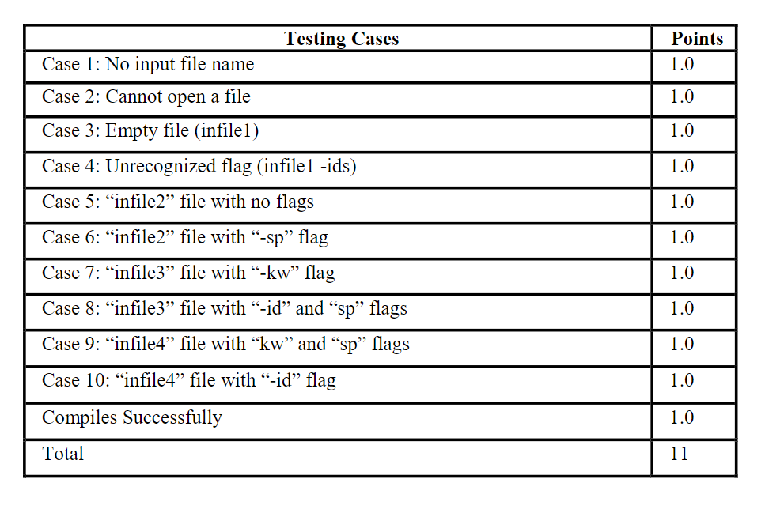

CS 280 
Spring 2025 
 
Short Assignment 4 
Counting Occurrences of Word Types 
 
February 17, 2025 
 
Due Date: Friday, February 21, 2025, 23:59 
Total Points: 11 
 
 
Write  a  C++  program  that  accepts  one  or  more  command  line  arguments  for  a  file  name  and  optional input flags. However, if no file name is provided, the program should print on a new line "NO SPECIFIED  INPUT FILE NAME.", and then exit.

 If the file  cannot be opened, print on a  new line "CANNOT OPEN THE FILE ", followed by the file name, and then exit. The program should read from the file words until the end of file. The objective of the program is to recognize and count the occurrences of words of three types of words (as defined in SA3). 
 
 Those are the Special Words, Keywords, and Identifiers. If the input file is empty, the program should print out on a new line the message "The File is Empty." and then exit. The program prints out the total number of lines and words in the file, and the number of words of each category of Words. 
 
 However, the program prints out each word of a category and the number of its occurrences in the input file, based on a specified command line argument for that category. The words of each category are listed in order. Invalid words of a category are printed out as error messages  similar  to  SA  3.  The  command  line  arguments,  that  are  accepted  by  the  program,  are listed in any order.  Those are defined as follows: 

• A file name.

• Optional arguments that are specified using the following flags: 

▪  “-id”: The program prints out each Identifier Word and the number of 
its occurrences in the file only. 

▪ “-sp”: The program prints out each Special Word and the number of its occurrences in the file only. 

▪ “-kw”: The program prints out each Keyword and the number of its occurrences in the 
file only. 
 
In case more than one flag is specified, words and their occurrences are printed out in the order of 
Special Words first, followed by Identifiers, then Keywords. 
 
### Passing 10/11 - Fails Test Case 8.

