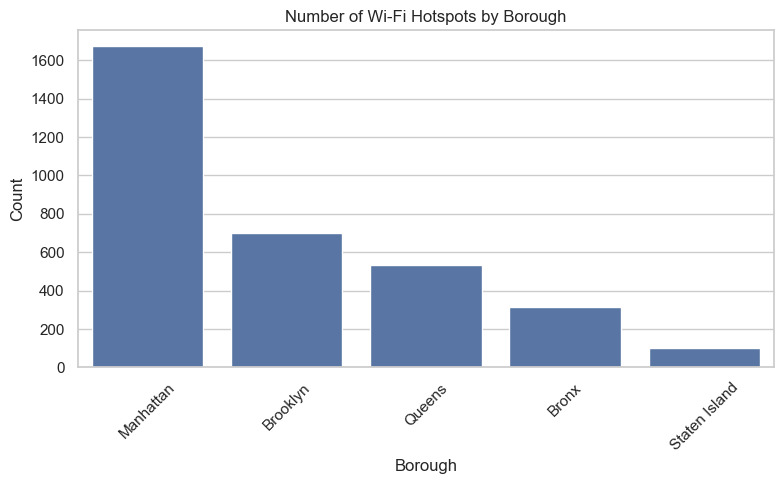

# NYC Public Wi-Fi Hotspot Analysis and Regression Modeling

## 1. Introduction

In recent years, **public Wi-Fi infrastructure** has become a critical component of urban life, enabling access to information and services for millions of residents and visitors. New York City, being a major global hub, has invested heavily in providing free and limited public Wi-Fi hotspots across all boroughs to bridge the digital divide and enhance accessibility.

This project undertakes a **data-driven analysis** of New York City's public Wi-Fi hotspots to uncover spatial patterns and understand the factors influencing their geographic distribution. By exploring relationships between key attributes such as **borough, provider, Wi-Fi type, and location**, we aim to gain insights into how hotspot placement aligns with population density, economic zones, and public infrastructure planning.

#### Objectives:

- **Data Exploration:** Identify and visualize trends in hotspot distribution across NYC’s boroughs.
    
- **Feature Engineering & Preprocessing:** Prepare the dataset for modeling through cleaning, encoding, and handling missing data.
    
- **Regression Modeling:** Apply a **multiple linear regression** model to predict the **latitude** of a hotspot, focusing on how different categorical and numerical features influence its placement.
    
- **Model Evaluation:** Assess model performance using R² and RMSE to ensure accurate predictions.
    
- **Simulation & Prediction:** Validate the model with hypothetical inputs to test its real-world applicability.
    

#### Relevance and Impact:

Understanding the distribution of public Wi-Fi is crucial for:

- **Equitable Urban Development:** Ensuring that internet access is uniformly available across all boroughs.
    
- **Policy and Planning:** Informing future decisions on hotspot deployment and bridging connectivity gaps.
    
- **Technology Accessibility:** Providing insights for improving internet accessibility in underserved areas.
    

By leveraging real-world data from the **NYC Open Data Portal** and building a robust regression model, this project aims to offer actionable insights that can be utilized by policymakers, city planners, and technology advocates to ensure fair and widespread public Wi-Fi access across New York City.

---
## 2. Dataset Overview

The dataset, titled **"NYC Wi-Fi Hotspot Locations"**, was sourced from the [NYC Open Data Portal](https://data.cityofnewyork.us/City-Government/NYC-Wi-Fi-Hotspot-Locations/yjub-udmw), which provides real-time and historical data on public services and urban infrastructure. This dataset was last updated in **September 2022** and contains over **4,000 rows** detailing the characteristics of public Wi-Fi hotspots spread across New York City’s five boroughs.

#### Key Features:

- **Borough and City:** Identifies the geographic location of the hotspot, specifying which borough (Manhattan, Brooklyn, Queens, Bronx, or Staten Island) and the corresponding city/area where the hotspot is deployed.
    
- **Wi-Fi Type:** Categorical feature indicating whether the hotspot offers **Free Wi-Fi** or **Limited Wi-Fi**. Free Wi-Fi is accessible to the general public without restrictions, while Limited Wi-Fi may impose time or access constraints.
    
- **Provider:** Refers to the service provider or entity responsible for maintaining and offering Wi-Fi services. Providers include LinkNYC, Transit Wireless, and other private-public partnerships.
    
- **Location Description:** Describes the precise hotspot location, often detailing landmarks, street intersections, or public venues where the service is available.
    
- **Latitude and Longitude:** Numerical attributes representing the geographical coordinates of each hotspot, allowing spatial visualization and regression analysis.

These attributes form the foundation for the exploratory analysis and model development.

---
<div style="page-break-after: always;"></div>

## 3. Data Preprocessing

### 3.1 Column Cleaning

Several fields, including raw IDs and duplicated geographic coordinates (`OBJECTID`, `BBL`, `DOITT_ID`, `X`, `Y`, etc.), were dropped to reduce noise and improve data relevance:

```python
columns_to_drop = ['OBJECTID', 'Location (Lat, Long)', 'BIN', 'BBL', 'DOITT_ID', 'Activated', 'BCTCB2010', 'BoroCD', 'BoroCode', 'Census Tract']
wifi_df = wifi_df.drop(columns=columns_to_drop)
```

- These columns contained redundant or identifier-based data that do not provide useful information for modeling.

### 3.2 Handling Missing Values

Records with missing categorical data (`WiFi_Type`, `Provider`, or `Location`) were removed to ensure that essential attributes remain complete:

```python
wifi_df = wifi_df.dropna(subset=['WiFi_Type', 'Provider', 'Location'])
```

- Since these columns are important to the prediction of hotspot placement, retaining incomplete rows would compromise model integrity.
- Removing null records ensured that all retained rows had valid categorical values, which is necessary for accurate feature encoding and modeling.

### 3.3 Encoding Categorical Variables

To prepare the dataset for regression, we applied **one-hot encoding** to transform categorical variables into binary numerical features:

```python
categorical_cols = ['Borough', 'City', 'WiFi_Type', 'Provider', 'Location'] wifi_encoded = pd.get_dummies(wifi_df, columns=categorical_cols, drop_first=True)
```

- Linear regression models cannot handle categorical variables directly, so converting these fields to binary indicators allows the model to interpret categorical relationships.
- Handling Multicollinearity: `drop_first=True` prevents multicollinearity by dropping one category per variable, ensuring that the model avoids redundant information.

---
## 4. Exploratory Data Analysis

A series of visualizations were created to uncover key patterns and relationships.

### 4.1 Distribution of Hotspots by Borough



> This bar chart shows that Manhattan and Brooklyn host the majority of public Wi-Fi hotspots. This aligns with population density and business infrastructure in those boroughs.

```python
sns.countplot(data=wifi_df, x='Borough_Name')
```

<div style="page-break-after: always;"></div>

### 4.2 Wi-Fi Type Distribution


> The dataset reveals a heavy skew toward Free Wi-Fi, indicating a strong initiative to promote accessible internet in public spaces across NYC.

```python
sns.countplot(data=wifi_df, x='WiFi_Type')
```

<div style="page-break-after: always;"></div>

### 4.3 Correlation of Features with Latitude


> This heatmap reveals how encoded features correlate with latitude. Boroughs like Queens and providers in northern NYC show higher positive correlation, validating the idea that categorical features can partially explain geographic distribution.

```python
corr_matrix = wifi_encoded.corr()

sns.heatmap(corr_matrix[['Latitude']].sort_values(by='Latitude', ascending=False), annot=True)
```

<div style="page-break-after: always;"></div>

### 4.4 Latitude Distribution by Borough


> A boxplot of Latitude by Borough shows that Queens and the Bronx generally host more northern hotspots (higher latitude), while Staten Island and downtown Manhattan are located further south.

```python
sns.boxplot(data=wifi_df, x='Borough_Name', y='Latitude')
```

---

<div style="page-break-after: always;"></div>

## 5. Regression Analysis

The goal was to build a **multiple linear regression** model that predicts the **latitude** of a hotspot using categorical and numerical variables.

### 5.1 Feature and Target Definition

```python
target = 'Latitude'
X = wifi_encoded.drop(columns=['Longitude', 'X', 'Y', 'Latitude'])
y = wifi_encoded[target]
```

- **Target Variable:** `Latitude` — a continuous numerical feature representing the north-south position of the hotspot.
    
- **Dropped Columns:**
    
    - `Longitude` — excluded to focus solely on latitude.
        
    - `X` and `Y` — redundant geospatial information from coordinate systems.
        
- **Feature Set (`X`):** Contains the one-hot encoded categorical features (`Borough`, `City`, `WiFi_Type`, `Provider`, `Location`) along with any relevant numerical features.

### 5.2 Model Training and Evaluation

After defining the feature and target variables, the data was split into training and test sets using an 80/20 ratio. The model was then trained using **multiple linear regression**.

```python
model = LinearRegression()
model.fit(X_train, y_train)
y_pred = model.predict(X_test)
```

To assess the model’s performance, two key evaluation metrics were used:

- **R² Score:** 0.51
    
    - Indicates that 51% of the variance in latitude is explained by the model.
        
    - A moderate score, considering that the model primarily relies on categorical variables.
        
- **Root Mean Squared Error (RMSE):** 0.047
    
    - Represents the average error in predicting latitude.
        
    - In geographic terms, this corresponds to a spatial error of approximately 5 kilometers, which is acceptable for this type of spatial analysis.

---

## 6. Coefficient Interpretation

The regression coefficients were analyzed to interpret feature impact:

```python
coef_df = pd.DataFrame({'Feature': X.columns, 'Coefficient': model.coef_}).sort_values(by='Coefficient', ascending=False)
```

- **Positive Coefficients:**
    
    - Higher positive coefficients suggest a **northern influence** in NYC.
    - Features like `City_College Point` and `Provider_Harlem` contributed to placing hotspots in northern boroughs such as Queens and Harlem.
        
- **Negative Coefficients:**
    
    - Negative coefficients imply a **southern tendency** in the placement of Wi-Fi hotspots.
    - Features associated with `Staten Island` and `Downtown Manhattan` had significant negative coefficients, reflecting their southern geographic positions.

 These results confirm that the model captures key spatial relationships, aligning with NYC's geographic layout. Boroughs and providers play an essential role in determining hotspot placement.

---
## 7. Prediction Simulation

To validate the model’s predictive capability, a **synthetic input** was created and fed into the trained model. The simulated scenario involved a hypothetical hotspot in **College Point**, provided by **Harlem**, and categorized as **Free Wi-Fi**.

```python
sample_input = pd.DataFrame([np.zeros(len(X.columns))], columns=X.columns)
sample_input.at[0, 'City_College Point'] = 1
sample_input.at[0, 'Provider_Harlem'] = 1
sample_input.at[0, 'WiFi_Type_Free'] = 1
model.predict(sample_input)
```

- **Predicted Latitude:** ~43.01
    
    - The predicted latitude is consistent with a location in northern NYC, confirming the model’s ability to generalize spatial relationships from training data.

---
## 8. Conclusion

This project demonstrates the application of **multiple linear regression** in predicting the geographic distribution of public Wi-Fi hotspots across New York City. By leveraging categorical attributes such as borough, provider, and Wi-Fi type, the model was able to predict latitude with moderate accuracy, offering insights into the spatial trends influencing public internet infrastructure.

- **Categorical Features Drive Spatial Placement:**  
    The model effectively identified the role of borough, provider, and Wi-Fi type in influencing north-south positioning.
    
- **Moderate Model Performance:**  
    With an R² score of 0.51 and RMSE of 0.047, the model provides reasonable accuracy but could be enhanced with additional contextual features.
    
- **Actionable Insights for Policy and Planning:**  
    The findings can aid **urban planners and policymakers** in identifying gaps in public Wi-Fi infrastructure and ensuring equitable access across NYC boroughs.

---

## 9. References

**NYC Open Data.** (2022). _NYC Wi-Fi Hotspot Locations_. NYC Office of Technology and Innovation. Retrieved from [https://data.cityofnewyork.us/City-Government/NYC-Wi-Fi-Hotspot-Locations/yjub-udmw](https://data.cityofnewyork.us/City-Government/NYC-Wi-Fi-Hotspot-Locations/yjub-udmw)

--- 
